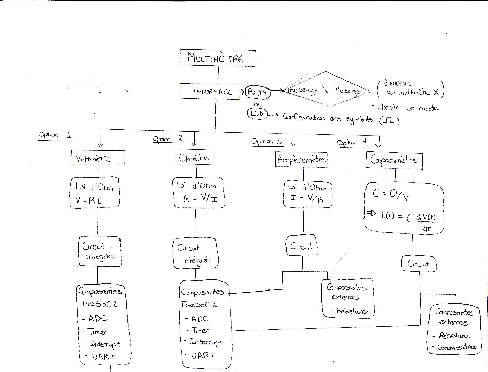

# Multimètre FreeSoC2 PSoC5LP DevBoard
Ce projet consiste a concevoir un multimètre à partir de notre microcontrôleur. 
En outre, cet outil sera composé d'un voltmère, d'un ohmètre, d'un ampèremètre et d'un capacimètre.
Les différentes composantes du multimètre sont intégrés à partir d'une interface conçue avec Putty.
De plus, deux relations mathématiques ont été nécessaires afin de fournir les données recherchées par 
l'utilisateur.

#### Loi d'Ohm
$V = RI$

#### La relation courant/capacitance
$C = \frac{q}{V}$

$i(t) = c*\frac{dv}{dt}$

## Volmètre

## Ohmètre

## Ampèremètre

## Capacimètre

