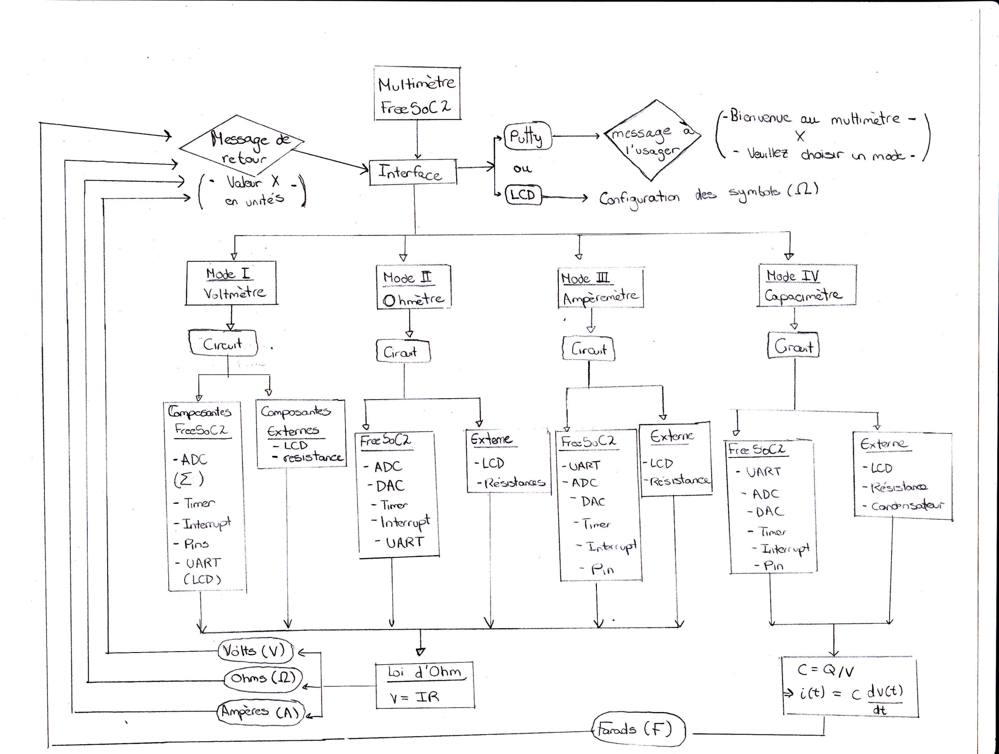
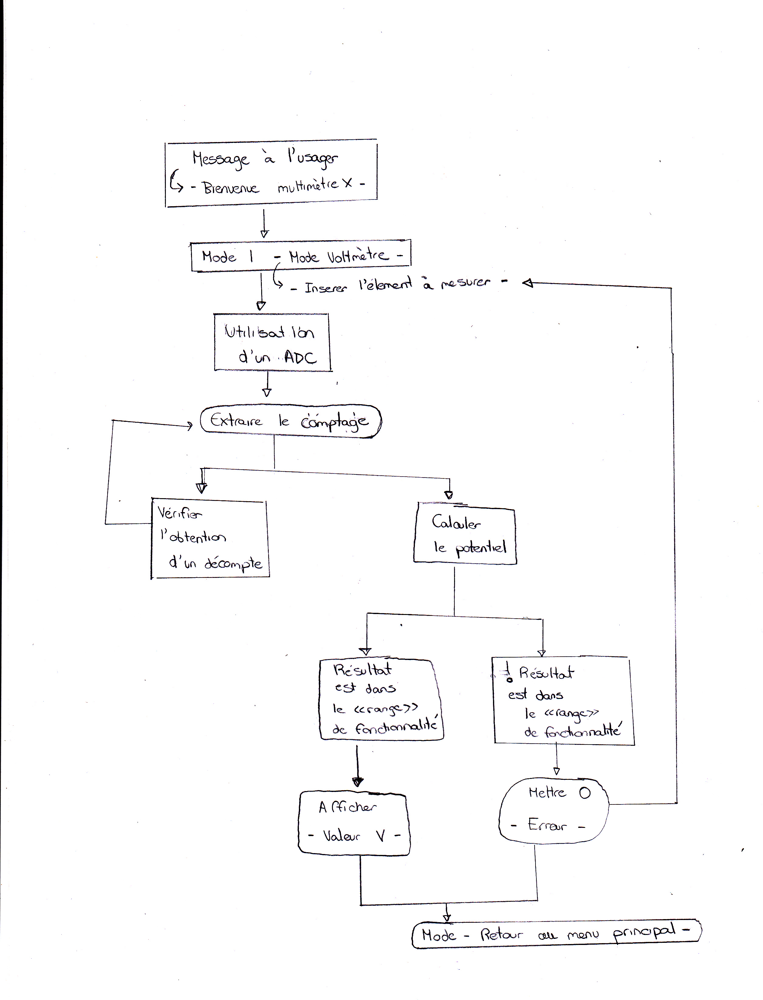
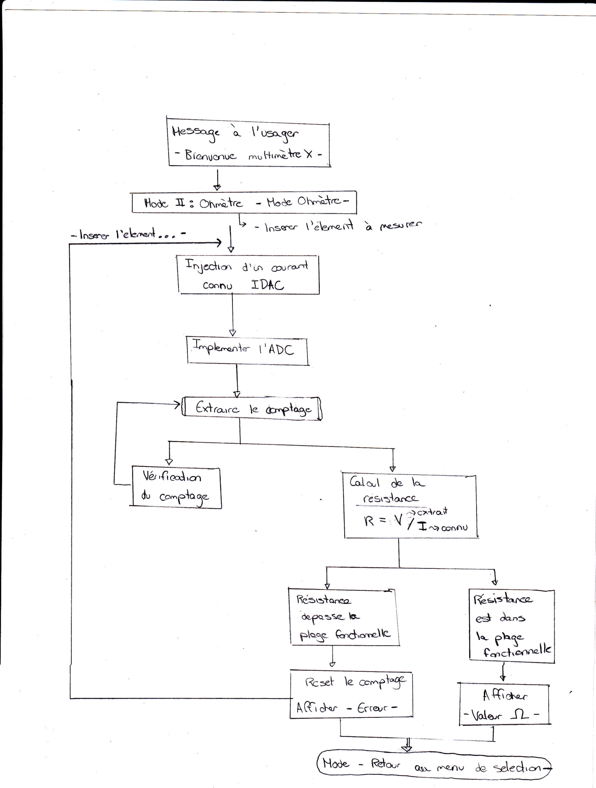

# Multimètre FreeSoC2 PSoC5LP DevBoard
Ce projet consiste a concevoir un multimètre à partir de notre microcontrôleur. 
En outre, cet outil sera composé d'un voltmère, d'un ohmètre, d'un ampèremètre et d'un capacimètre.
Les différentes composantes du multimètre sont intégrés à partir d'une interface conçue avec Putty.
De plus, deux relations mathématiques ont été nécessaires afin de fournir les données recherchées par 
l'utilisateur.

*Schéma du multimètre*

#### Loi d'Ohm

$`V=RI`$

#### La relation courant/capacitance

$`C = \frac{q}{V}`$

$`i(t) = C*\frac{dv}{dt}`$

## Volmètre

Ce voltmètre sera la composante du multimètre qui requiert le moins d'élements dans PSoC. En effet
on peut simplement construire un voltmètre à partir d'un ADC. Dans notre cas, on a choisi d'implementer
un ADC simple tel vu dans le laboratoire 3 du cours. 

*Schéma du Voltmètre*

Voici un tableau qui resume les caractéristiques principales de notre voltmètre.

| Voltmètre    |    Potentiel minimal      |    Potentiel maximal     | 
| :---         | :--------------------:    | -------------:           | 
| N/A          | Cell 2                    | Cell 3                   | 

## Ohmètre

En ce qui concerne l'Ohmètre, cette composante va s'inspirer du laboratoire 3 dans lequel nous avons du 
déterminer une résistance interne du FreeSoC2 PSoC5LP. Cépendant, on doit être en mesure d'extraire les 
valeurs de plusieurs résistance différentes qui se retrouvent dans une plage en particulier. Notre ohmètre,
est conçu à partir d'un iDAC et un ADC simple. Le iDAC permet de fournir un courant connu afin de pouvoir 
le segmenter avec le ADC pour extraire l'information sur le potentiel puis calculer la résistance par la 
loi d'Ohm. Le schéma ci-dessous indique la manière dont notre équipe à décidé d'approcher le problème.

*Schéma du Ohmètre*

Voici un tableau qui resume les caractéristiques principales de notre ohmètre. Les valeurs des résistances 
indiquées sur le tableau permet d'établir une plage dans lequel les valeurs fournis par l'Ohmètre sont 
près de celles fournis par le fabriquant d'un élément résistif.

| Ohmmètre     |    Résistance minimale    |    Résistance maximale   | 
| :---         | :--------------------:    | -------------:           | 
| N/A          | Cell 2                    | Cell 3                   | 

## Ampèremètre

## Capacimètre

