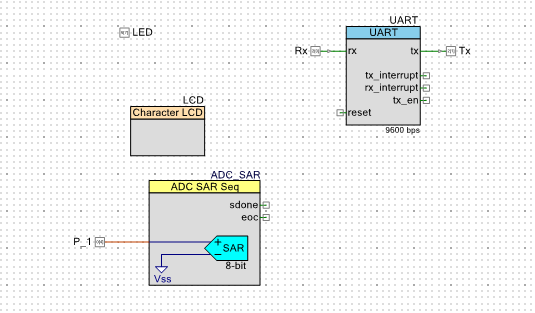

# Multimètre FreeSoC2 PSoC5LP DevBoard
Ce projet consiste à concevoir un multimètre à partir de notre microcontrôleur CY8C5888AXI-LP096. 
En outre, cet outil sera composé d'un voltmère, d'un ohmètre, d'un ampèremètre et d'un capacimètre.
Les différentes composantes du multimètre sont intégrés à partir d'une interface conçue avec Putty.
De plus, deux relations mathématiques ont été nécessaires afin de fournir les données recherchées par 
l'utilisateur.

*Figure 1: Schéma du multimètre*

## Matériel

-   FreeSoC 5LP
-   PSoC Creator 4.2
-   Kit de résistance
-   Potentiomètre 10kOhm
-   Putty
-   Fils jumper
-   Condensateur
-   écran LCD

#### Loi d'Ohm

$`V=RI`$

#### La relation courant/capacitance

$`C = \frac{q}{V}`$

$`i(t) = C*\frac{dv}{dt}`$

  
 La branche Voltmètre

## Volmètre

- [ ] Task 1 Completer tableaux essais
- [ ] Task 2 insérer des images du montage expérimental
- [ ] Task 3 insérer une image du TopDesign

Ce voltmètre sera la composante du multimètre qui requiert le moins d'élements dans PSoC. En effet
on peut simplement construire un voltmètre à partir d'un ADC. Dans notre cas, on a choisi d'implementer
un ADC simple tel vu dans le laboratoire 3 du cours. 

*Figure 2: Schéma du Voltmètre*

Voici un tableau qui resume les caractéristiques principales de notre voltmètre.

Tableau 1: Caractéristiques du Ohmètre

| Voltmètre    |    Potentiel minimal      |    Potentiel maximal     | 
| :---         | :--------------------:    | -------------:           | 
| N/A          | 0 mv                      | 5000 mV                  | 

### Essais expérimentaux

Pour effectuer nos tests, on a utilisé un potentiomètre de 10kOhms afin de varier le potentiel affichées.
Lors de nos essais on remarquait un variation du potentiel lorsqu'on tournait le potentiomètre. Un multimètre
industriel a été utilisé pour des fins de comparaison. 

Tableau 2: Essais expérimentaux effectués sur le volmètre

| Voltmètre    |    Potentiel  affiché     |    Potentiel écrit       | 
| :---         | :--------------------:    | -------------:           | 
| essai 1      | Cell 2                    | Cell 3                   | 
| essai 2      | Cell 2                    | Cell 3                   | 
| essai 3      | Cell 2                    | Cell 3                   | 

*Figure 2: Schéma du TopDesign du voltmètre*

  
 La branche Ohmètre

  
## Ohmètre

- [ ] Task 1 Completer tableaux essais
- [ ] Task 2 insérer des images du montage expérimental
- [ ] Task 3 insérer une image du TopDesign

En ce qui concerne l'Ohmètre, cette composante va s'inspirer du laboratoire 3 dans lequel nous avons du 
déterminer une résistance interne du FreeSoC2 PSoC5LP. Cépendant, on doit être en mesure d'extraire les 
valeurs de plusieurs résistance différentes qui se retrouvent dans une plage en particulier. Notre ohmètre,
est conçu à partir d'un iDAC et un ADC simple. Le iDAC permet de fournir un courant connu afin de pouvoir 
le segmenter avec le ADC pour extraire l'information sur le potentiel puis calculer la résistance par la 
loi d'Ohm. Le schéma ci-dessous indique la manière dont notre équipe à décidé d'approcher le problème.

*Figure 3: Schéma du Ohmètre*

Voici un tableau qui resume les caractéristiques principales de notre ohmètre. Les valeurs des résistances 
indiquées sur le tableau permet d'établir une plage dans lequel les valeurs fournis par l'Ohmètre sont 
près de celles fournis par le fabriquant d'un élément résistif.

Tableau 3: Caractéristiques du Ohmètre

| Ohmmètre     |    Résistance minimale    |    Résistance maximale   | 
| :---         | :--------------------:    | -------------:           | 
| N/A          | Cell 2                    | Cell 3                   | 

### Essais expérimentaux

Pour effectuer nos tests, on a utilisé un potentiomètre de 10kOhms afin de varier les résistances affichées.
Lors de nos essais pour le mode ohmètre de notre multimètre, nous avons rémarque un écart entre la valeur affiché par notre multimètre est la valeur mesure par un multimètre industriel. Cette différence peut être expliqué par la 
présence d'une impédance dans notre FreeSoC qui affecte la valeur de la résistance calculée. 

Tableau 4: Essais expérimentaux effectués sur l'ohmètre

| Ohmmètre     |    Résistance affichée    |    Résistance écrite     | 
| :---         | :--------------------:    | -------------:           | 
| essai 1      | Cell 2                    | Cell 3                   | 
| essai 2      | Cell 2                    | Cell 3                   | 
| essai 3      | Cell 2                    | Cell 3                   | 

  
 La branche Ampèremètre

## Ampèremètre

- [ ] Task 1 Completer paragraphe de description
- [ ] Task 2 insérer tableau de caractéristiques
- [ ] Task 3 completer le tableau de caractéristique
- [ ] Task 4 Completer tableaux essais
- [ ] Task 5 insérer des images du montage expérimental
- [ ] Task 6 insérer une image du TopDesign
- [ ] Task 7 insérer schéma 
 

  
 La branche Capacimètre

  
## Capacimètre

- [ ] Task 1 Completer paragraphe de description
- [ ] Task 2 insérer tableau de caractéristiques
- [ ] Task 3 completer le tableau de caractéristique
- [ ] Task 4 Completer tableaux essais
- [ ] Task 5 insérer des images du montage expérimental
- [ ] Task 6 insérer une image du TopDesign
- [ ] Task 7 insérer schéma 

## Composantes à améliorer 

1. Insérer un pont de communication avec Matlab pour un transfer de données
2. Intégrer des ampli-op du FreeSoC pour augmenter la plage fonctionnelle
3. Améliorer l'interface de l'usage avec un module graphique
4. xxxxxxxxxxxxxxxxx

