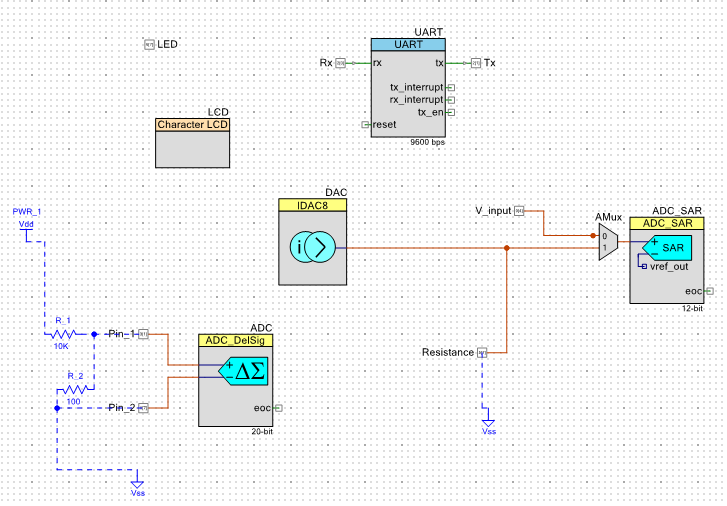
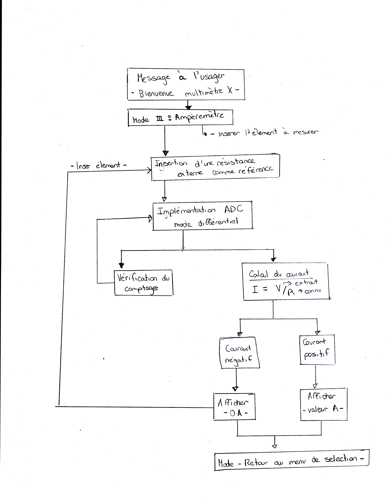
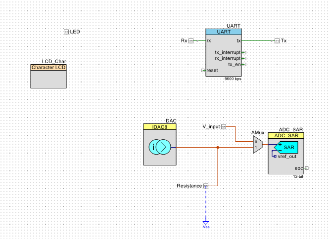
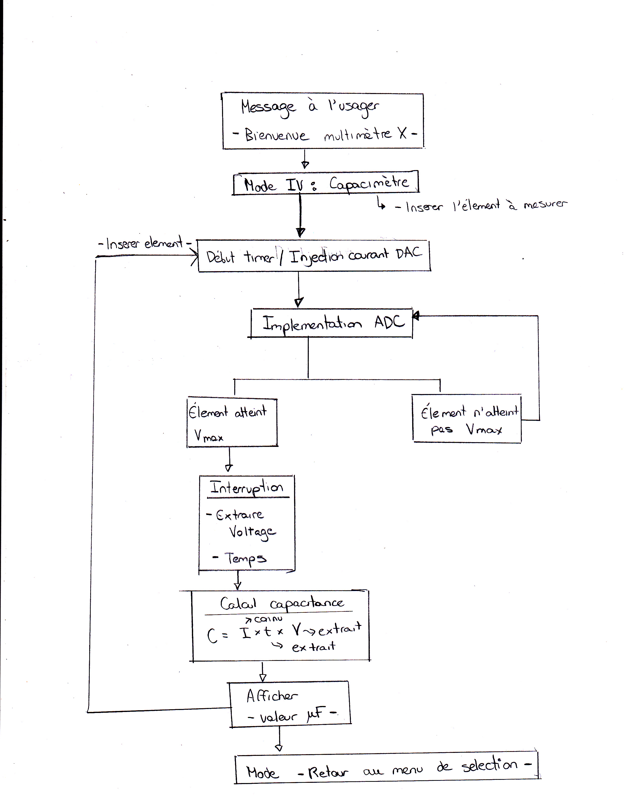
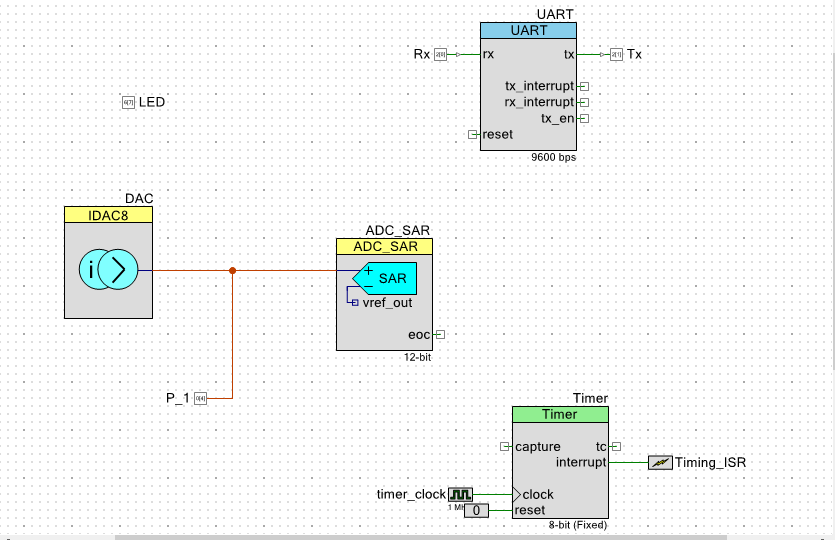
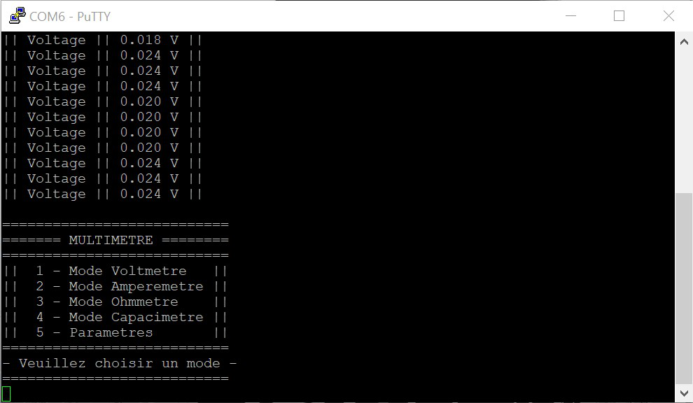
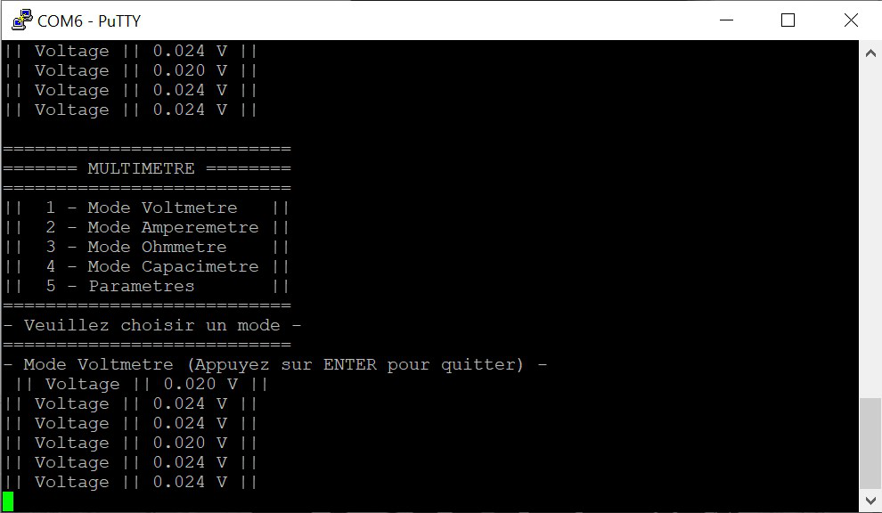
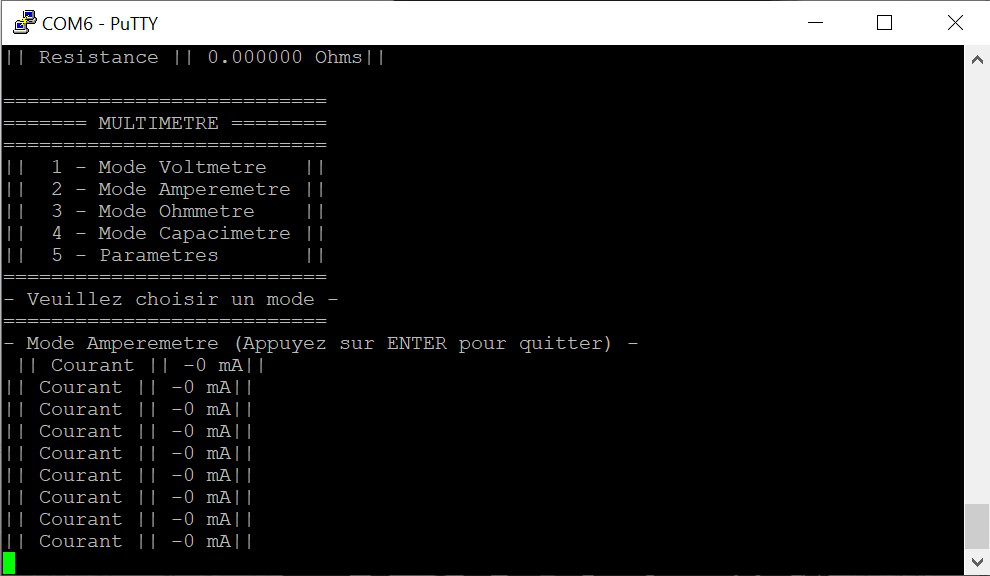
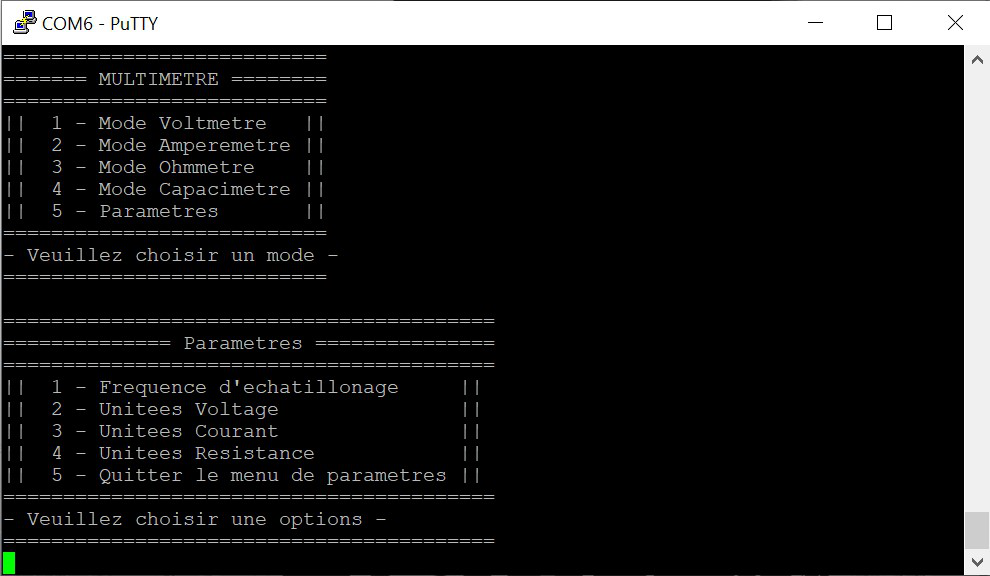
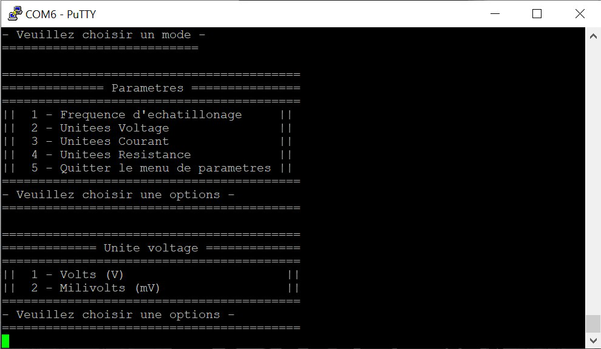

# Multimètre FreeSoC2 PSoC5LP DevBoard

Dans le cadre du cours GBM2100, nous avons opté pour l'élaboration d'un multimètre à l'aide d'un microcontrôleur pour le projet intégrateur de la session d'hiver 2020.. 
Notre intérêt est focalisé sur la conception d'un voltmètre, d'un ohmètre, d'un ampèrmètre, ainsi qu'un capacimètre si nous avons le temps. 
Les différentes composantes du multimètre sont intégrés à partir d'une interface conçue avec Putty. 
Une configuration d'un menu a été ajouté. 
Il est un outil permettant de choisir la composante voulue en saisissant le numéro correspondant de cette dernière. 
Ainsi, cet outil est une application desntinée à faciliter la sélection de la composante voulue ainsi que des unités d'affichage. 

Dans les prochaines lignes, nous abordons les différentes étapes permettant la création et l'optimisation d'un multimètre.
Nous commençons tout d'abord, par spécifier le matériel et les deux relations mathématiques permettant de fournir les données recherchées par l'utilisateur. 
Par la suite, nous enchaînons avec l'explication de chaque branche crée.

Le schéma suivant illustre notre plan de conception du multimètre:

*Figure 1: Schéma du multimètre*

*Figure 2: TopDesign du multimètre*

## Matériel

-   FreeSoC 5LP- CY8C5888AXI-LP096
-   PSoC Creator 4.2
-   Kit de résistance
-   Potentiomètre 10kOhm
-   Putty
-   Fils jumper
-   Condensateur
-   écran LCD

#### Loi d'Ohm

$`V=RI`$

#### La relation courant/capacitance

$`C = \frac{q}{V}`$

$`i(t) = C*\frac{dv}{dt}`$

## Volmètre

- [x] Task 1 Completer tableaux essais
- [x] Task 2 insérer des images du montage expérimental
- [x] Task 3 insérer une image du TopDesign

Le voltmètre permet de mesurer la tension dans un circuit électrique entre deux points.
Ce voltmètre sera la composante du multimètre qui requiert le moins d'élements dans PSoC. En effet
on peut simplement construire un voltmètre à partir d'un ADC_SAR Seq et un UART. 
Dans notre cas, on a choisi d'implementer un ADC simple tel vu dans le laboratoire 3 du cours. 

Le schéma suivant illustre le fonctionnement de la composante voltmètre :

*Figure 3: Schéma du Voltmètre*

Voici un tableau qui resume les caractéristiques principales de notre voltmètre.

Tableau 1: Caractéristiques du Ohmètre

| Voltmètre    |    Potentiel minimal      |    Potentiel maximal     | 
| :---         | :--------------------:    | -------------:           | 
| N/A          | 0 mv                      | 2048 mV                  | 

### Essais expérimentaux

Pour effectuer nos tests, on a utilisé un potentiomètre de 10kOhms afin de varier le potentiel affichées.
Lors de nos essais on remarquait un variation du potentiel lorsqu'on tournait le potentiomètre. Un multimètre
industriel a été utilisé pour des fins de comparaison. 

Tableau 2: Essais expérimentaux effectués sur le volmètre

| Voltmètre    |    Potentiel  affiché (mV)|    Potentiel écrit (mV)  | 
| :---         | :--------------------:    | -------------:           | 
| essai 1      | 2047                      | 2048                     | 
| essai 2      | 4940                      | 5000                     | 

*Figure 4: TopDesign du voltmètre*

*Figure 5: Montage expérimental du voltmètre*

  
## Ohmètre

- [x] Task 1 Completer tableaux essais
- [x] Task 2 insérer des images du montage expérimental
- [x] Task 3 insérer une image du TopDesign

En ce qui concerne l'Ohmètre, cette composante va s'inspirer du laboratoire 3 dans lequel nous avons dû 
déterminer une résistance interne du FreeSoC2 PSoC5LP. Cépendant, on doit être en mesure d'extraire les 
valeurs de plusieurs résistance différentes qui se retrouvent dans une plage en particulier. Notre ohmètre,
est conçu à partir d'un iDAC et un ADC simple. Le iDAC permet de fournir un courant connu afin de pouvoir 
le segmenter avec le ADC pour extraire l'information sur le potentiel puis calculer la résistance par la 
loi d'Ohm. Le schéma ci-dessous indique la manière dont notre équipe à décidé d'approcher le problème.

*Figure 6: Schéma du Ohmètre*

Voici un tableau qui resume les caractéristiques principales de notre ohmètre. Les valeurs des résistances 
indiquées sur le tableau permet d'établir une plage dans lequel les valeurs fournis par l'Ohmètre sont 
près de celles fournis par le fabriquant d'un élément résistif.

Tableau 3: Caractéristiques du Ohmètre

| Ohmmètre     |    Résistance minimale ($`\Omega`$)   |    Résistance maximale ($`\Omega`$)  | 
| :---         | :------------------------------------:| ------------------------------------:| 
| N/A          | 0                                     | 120 000                              | 

### Essais expérimentaux

Pour effectuer nos tests, on a utilisé un potentiomètre de 10kOhms afin de varier les résistances affichées.
Lors de nos essais pour le mode ohmètre de notre multimètre, nous avons rémarque un écart entre la valeur affiché par notre multimètre est la valeur mesurée par un multimètre industriel. 
Cette différence peut être expliqué par la 
présence d'une impédance dans notre FreeSoC qui affecte la valeur de la résistance calculée. 
Le lien suivant est conçu pour vous diriger vers le fichier Excel qui présente un tableau et un graphique montrant la différence entre les valeurs de résistance théorique et celle expérimentale obtenu à l'aide de l'interface PuTTy.

[Essais expérimentaux effectués sur l'ohmètre](https://docs.google.com/spreadsheets/d/e/2PACX-1vTpft_QFTHJTE6t6AvndqwOW35QqkJcjC4h1Y33P8fuqk1R-fKJRkmImc00Alzv2B-iJ3qAoD9SoYSs/pubhtml).

*Figure 7: TopDesign du ohmmètre*

*Figure 8: Montage expérimental du ohmmètre*

## Ampèremètre

- [x] Task 1 Completer paragraphe de description
- [x] Task 2 insérer tableau de caractéristiques
- [x] Task 3 completer le tableau de caractéristique
- [x] Task 4 Completer tableaux essais
- [x] Task 5 insérer des images du montage expérimental
- [x] Task 6 insérer une image du TopDesign
- [x] Task 7 insérer schéma 

Pour ce qui est de l'ampèremètre, nous avons dû pousser nos recherches en ce qui concerne la disposition de notre circuit, 
les composantes que nous voulions utiliser ainsi que les branchements que nous souhaitions faire pour que le tout puisse fonctionner
étant donné que nous n'avions pas de modèle de référence en tant que tel contrairement au voltmètre et au ohmmètre. 
Cette fonction du multimètre a donc été celle qui a demandé une recherche plus poussée de notre part. 
On note qu'il faut tenir compte des impédances de FreeSoC et les limites physiques des pins.

Afin de concevoir cette fonction, nous avons opté pour des résistances externes plutôt qu'interne. Notre ampèremètre
est conçu d'un ADC_SAR, d'un iDAC et d'une composante UART. Le iDAC permet de trouver le courant issu de la résistance externe
et du potentiel segmenter par l'ADC à l'aide de la formule de la loi d'Ohm. 
Le schéma ci-dessous indique la manière dont notre équipe à décidé d'approcher le problème.

*Figure 9: Schéma de l'ampèremètre*

Voici un tableau qui resume les caractéristiques principales de notre ampèremètre.
[Compléter le texte]

Tableau 5: Caractéristiques de l'Ampèremètre

| Ampèremètre  |    Courant minimal (mA)   |    Courant maximal (mA)  | 
| :---         | :--------------------:    | -------------:           | 
| N/A          | 0                         | 47                       | 

### Essais expérimentaux

[Insérer un texte]

Tableau 6: Essais expérimentaux effectués sur l'ampèremètre

| Ampèremètre  |    Courant affiché (mA)   |    Courant écrit (mA)    | 
| :---         | :--------------------:    | -------------:           | 
| essai 1      | 47                        | 50                       | 

 

*Figure 10: TopDesign de l'ampèremètre*

*Figure 11: Montage expérimental de l'ampèremètre*

  
## Capacimètre

- [x] Task 1 Completer paragraphe de description
- [ ] Task 2 insérer tableau de caractéristiques
- [ ] Task 3 completer le tableau de caractéristique
- [ ] Task 4 Completer tableaux essais
- [ ] Task 5 insérer des images du montage expérimental
- [x] Task 6 insérer une image du TopDesign
- [x] Task 7 insérer schéma 

La composant du capacimètre avait le but de charger un condensateur en appliquant un courant
et par la suite, on fait une lecture d'ADC et en utilisant la relation entre la courant/capacitance, 
on sera capable de trouver la vouleur de la capacitance. Cela nécessite également un timer qui va gérer le temps de chragement du condensateur.
Cette association entre le timer et le temps de chargements du condensateur est plus compliquée que nous le pensions.
Cela demandera du temps et plusieurs essaies. Ainsi, nous n'étions pas en mesure de la compléter.

Le schéma décrivant le fonctionnement de la composante capacimètre est la suivante:

*Figure 12: Schéma du capacimètre*

Voici le TopDesign du capacimètre que nous avons entamé, mais que nous n'avons pas pû compléter faute de temps et de ressources.

*Figure 13: TopDesign du capacimètre*

## Composantes à améliorer 

Les prochains points sont des idées que nous avons pensé faire afin d'améliorer
notre projet. Ces ajouts requièrent une connaissance approfonfie dans le fonctionnement des
microcontrôleurs. 

1. Insérer un pont de communication avec Matlab pour un transfer de données
2. Intégrer des ampli-op du FreeSoC pour augmenter la plage fonctionnelle
3. Améliorer l'interface de l'usage avec un module graphique
4. Intégrer la composante LCD au multimètre
5. Intégrer un clavier 4x4 matriciel
6. Intégrer la gestion de tâches avec FreeRTOS

## Interface Utilisateur (putty)

Afin qu'un utilisateur puisse utiliser notre multimètre, une interface a été concue sur putty. Celle-ci consiste en un menu et sous-menus permettant de choisir le mode du multimètre (voltmètre ampèremètre ou ohmmètre) et d'accèder au menu de paramètres afin de changer l'unité d'affichage du multimètre ainsi que de changer la vitesse d'afichage des mesures (fréquence d'échatillonage).

Le menu principal comporte les options suivantes:

1. Mode Voltmètre
2. Mode Ampèremètre
3. Mode Ohmmètre
4. Mode Capacimètre
5. Paramètres

Même si l'interface utilisateur est très intuitive, un mode d'emploi définira plus en profondeur les détails importants du fonctionnement du menu.

Mode d'emploi du menu du multimètre: 
- Pour sélectionner une option, il suffit d'entrer au clavier le chiffre correspondant à l'option. Si le caractère n'est pas valide, on retourne au menu principale. La même logique s'applique aux sous-menus.
- Afin de quitter les différents modes du multimètres il suffit d'appuyer sur nimporte quelle touche.
- Dans le menu des paramètres, après avoir sélectionner une option, on retourne automatiquement au menu principal.

*Figure 14: Capture du menu principal*

*Figure 15: Exemple de mesures du voltmètre*

*Figure 16: Exemple de mesure de l'ampèremètre*

*Figure 17: Menu des paramètres*

*Figure 16: Exemple menu de changement d'unités*

## Tests supplémentaires

À des fins de vérification supplémentaires, un multimètre industriel a été utilisé pour s'assurer du bon fonctionnement général du multimètre car les mesures prises avec le multimètre industriel n'étaient pas assez précices pour valider les mesures calculées avec notre multimètre. Cepandant les mesures approximatives nous ont permis de s'assurer les mesures était faites au bon endroit dans le circuit et que le mutimètre donnait approximativement des bonne valeur puisque les valeurs données par le multimètre industriel sont indiquées par une aiguille.

*Figure 17: Photo du multimètre industriel*
